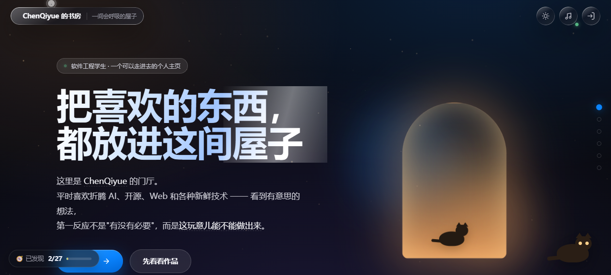
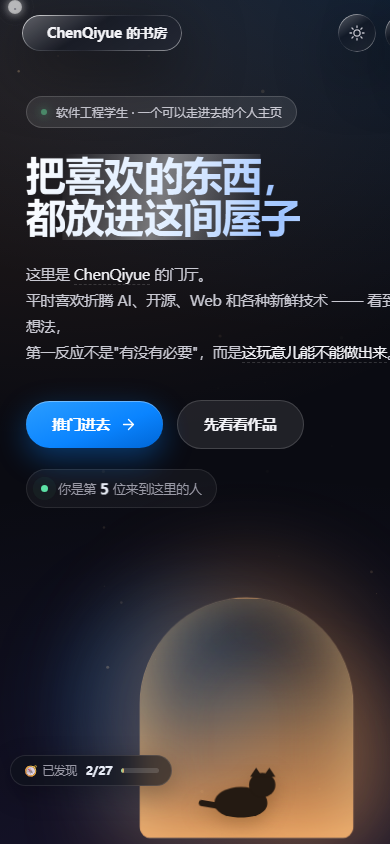
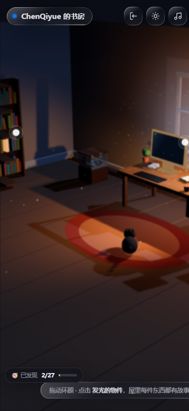
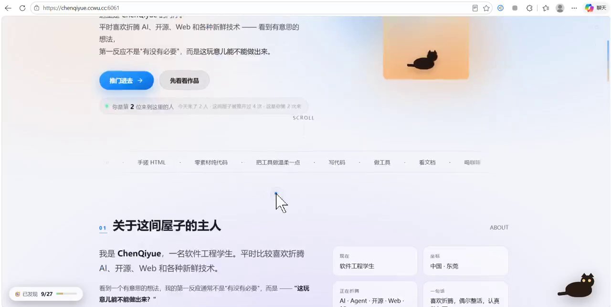

# 陈启粤的书房 · ChenQiyue's Study

> 一间会呼吸的屋子 —— 你可以在浏览器里**推门进去**。

**🌐 在线体验：https://chenqiyue.ccwu.cc/**

一个纯手搓的个人网站：门厅是 2D 的，推门进去是一个用 **Three.js 手写**的 3D 房间，屋里每件东西都能点。零素材、零框架、零构建，主体是**一个 HTML 文件**。

---

## 这是什么

不是一页简历式的个人主页，而是"一间屋子"：

- **门厅**：进入时的落地页，写清楚我是谁、在折腾什么、做过什么
- **推门进去**：切到 3D 房间，可以拖动环顾、点屋里的东西
- **屋里每件东西都有故事**：挂钟、鱼缸、吉他、窗台气象、纸飞机、地球仪、桌上那叠手稿……
- **藏了彩蛋**：屋里有可探索的"秘密"（右上角有发现进度），还有一个"抓 Bug"小游戏
- **真实的访客计数器**：右下角那个数字是真的人在访问时才增长（不是假数据）

---

## 截图

| 门厅（桌面） | 门厅（移动端） | 3D 房间（移动端） |
|---|---|---|
|  |  |  |

## 演示视频

[](https://qiyuechen0929.github.io/personal-website/docs/media/demo.mp4)

▶ **[点这里播放演示视频](https://qiyuechen0929.github.io/personal-website/docs/media/demo.mp4)**（仓库内版本，已压缩为网络可直接播放）

- 仓库内视频文件：[`docs/media/demo.mp4`](docs/media/demo.mp4)
- 也可以在 X 上看：[@chenqiyueapgm](https://x.com/chenqiyueapgm)

> 全尺寸原片（116.9 MB）未入库，仓库内为压缩后的网络版，内容一致。

---

## 特性

### 门厅（2D）
- 首屏标题、自我介绍、项目卡片、书架、联系方式、到处"推门进去"
- 滚动进场动画、跑马灯标签、明暗主题切换
- 移动端适配（≤760px / ≤430px 专门处理过）

### 房间（3D · Three.js 手搓）
| 物件 | 交互 |
|---|---|
| 挂钟 | 指针按**北京时间**实时走动（时区无关实现） |
| 鱼缸 | 视角推近看鱼 |
| 吉他 | 能拨响（WebAudio 合成音，无需音频素材） |
| 窗台气象 | 点一下看天气信息 |
| 纸飞机 | 桌上纸堆点一下能飞出一架 |
| 地球仪 | 点一下随机去一个城市，显示**距离 + 当地时间和时差** |
| 桌上手稿 | 我在 X 上写的思考，点开跳原文 |
| 撸猫 / 探索 / 抓 Bug | 隐藏玩法与成就 |

### 工程上的讲究
- **零素材**：没有一张图片、一个音频文件，全部 CSS / Canvas / WebAudio / 程序化贴图
- **零依赖**：除 vendor 的 Three.js 外没有任何运行时依赖，没有构建步骤
- **可访问性/兜底**：WebGL 不可用时给出提示而不是白屏；`prefers-reduced-motion` 尊重系统设置
- **压缩**：后端对 HTML/JS 做 gzip/brotli + ETag 304，首屏从 842KB/5.6s 降到 ~204KB/~1.2s

---

## 技术栈

| 层 | 用了什么 |
|---|---|
| 界面 | 原生 HTML + CSS（自定义设计 token + `.glass` 毛玻璃材质）+ 原生 JS |
| 3D | Three.js r152（本地 vendor，不用 CDN） |
| 音频 | WebAudio API 实时合成（吉他、音效） |
| 后端 | Node.js 原生 `http`/`https`，**零依赖**（没有 express） |
| HTTPS | Let's Encrypt 证书 + acme.sh **DNS-01** 校验（不需要 80 端口、不需要备案） |
| 续期 | 服务进程内置定时自检（每 12h），续签后**热加载证书**，不重启 |

---

## 目录结构

```
.
├── index.html              # 网站本体（单文件，含全部样式与逻辑）
├── vendor/
│   └── three.min.js        # Three.js r152（本地托管）
├── server/
│   ├── server.mjs          # 访客计数后端 + 静态托管 + gzip/brotli + HTTPS + 自动续期
│   └── README.md           # 后端说明
├── src/                    # 模块化源码分片（开发时用，注入进 index.html）
│   ├── site.css / site.js / site.html
│   ├── site2.* site3.js site5.* site6.js
│   ├── visitor.css / visitor.js
│   └── build.mjs           # 注入 + 语法自检构建脚本
├── docs/
│   ├── DEPLOY.md           # 部署到服务器的完整步骤
│   ├── screenshots/
│   └── media/              # 演示视频（待补）
├── LICENSE
└── README.md
```

---

## 本地运行

### 只看前端
直接用浏览器打开 `index.html` 即可（除了访客计数，其余功能都在前端）。

想更接近线上环境，起个静态服务器：

```bash
npx serve .          # 或 python -m http.server 8080
```

> ✅ 资源用的是**相对路径**（`vendor/three.min.js`），所以放在任何子路径下（例如 `https://user.github.io/repo/`）都能直接跑。

### 连上访客计数后端

```bash
cd server
node server.mjs          # 默认 8790 端口，静态目录指向上一级
# 可选环境变量：
#   PORT=6061
#   SITE_DIR=/path/to/site
#   DATA_FILE=./data/visits.json
#   TLS_DIR=<SITE_DIR>/.certs     # 放 fullchain.pem + privkey.pem 就自动启用 HTTPS
```

前端在 `index.html` 的 `CONFIG.visitor.api` 里配置后端地址（留空则退化为本地存储计数）。

---

## 访客计数器是怎么算的

浏览器首次访问时生成一个随机 ID 存在 `localStorage`，之后每次带着它。服务器**只对没见过的 ID 计数**，见过的只加次数。

| 页面显示 | 含义 | 是否去重 |
|---|---|---|
| 你是第 N 位来到这里的人 | 累计访客 | ✅ 按浏览器去重 |
| 今天来了 N 人 | 当日访客 | ✅ |
| 这间屋子被推开过 N 次 | 总访问次数 | ❌ |
| 这是你第 N 次来 | 单个访客的次数 | ❌ |

**隐私说明**：不存 IP、不做指纹、不写第三方统计，只有"一个随机 ID + 次数"，数据存在自己的服务器上。

---

## 部署到服务器

线上实例跑在**一台 1.6G 内存的轻量云服务器**上，容器只做一件事：跑 `server/server.mjs`。

```bash
# 1) 把站点文件放到宿主机目录（index.html / vendor/ / server/）
# 2) 用容器跑后端（示例：镜像当 Node 运行时用）
docker run -d --name mysite --restart unless-stopped \
  -p 6061:6061 \
  -v /path/to/site:/site \
  -e PORT=6061 \
  --entrypoint /usr/local/bin/node \
  <node-image> /site/server/server.mjs
```

```bash
# 3) 签发 HTTPS 证书（DNS-01，无需 80 端口、无需备案）
export CF_Token=<Cloudflare API Token>   # 权限：Zone → DNS → Edit
export CF_Zone_ID=<你的 Zone ID>
acme.sh --issue --dns dns_cf -d your.domain --keylength ec-256
acme.sh --install-cert -d your.domain --ecc \
  --key-file  /path/to/site/.certs/privkey.pem \
  --fullchain-file /path/to/site/.certs/fullchain.pem
```

之后 `server.mjs` 会自动启用 HTTPS，并在每 12 小时自检续期、续签后热加载证书 —— **90 天到期也不用管**。

细节见 [`docs/DEPLOY.md`](docs/DEPLOY.md)。

---

## 已知限制（说实话）

1. **计数器需要后端**：纯静态托管（GitHub Pages / 各类 PaaS）上，计数会退化为本地存储 —— 想要真实数字就得让它连自己的后端。
2. **非标准端口的国内提示**：用 `域名:6061` 这种形态，部分国内浏览器/App 会提示"危险网站"（这是"未备案 + 非常规端口"的策略提示，与证书无关）。要彻底消除，需要标准 443 端口（备案或走 CDN 代理）。
3. **3D 需要 WebGL**：极老的设备或禁用了 WebGL 的环境下，会自动降级为提示，进不了 3D 房间。

---

## 许可证

[MIT](LICENSE) © 2026 Chen Qiyue

Three.js 版权归其作者所有（MIT）。

## 关于我

- GitHub：[qiyuechen0929](https://github.com/qiyuechen0929)
- X：[@chenqiyueapgm](https://x.com/chenqiyueapgm)

如果这间屋子让你觉得有意思，欢迎进来逛逛，或者在 GitHub 点个 ⭐。
